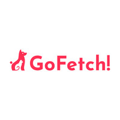

<a href="https://club-project-one.vercel.app/" target="_blank">

</a>

# GoFetch 🐾

**GoFetch**는 반려동물과 함께하는 여행을 위한 맞춤형 정보 제공 플랫폼입니다.  
React, TypeScript를 기반으로 개발되었으며, 반려동물 동반 가능 장소, 음식점, 케어 서비스 등을 쉽게 검색할 수 있습니다.

<br/>

---

### 주요 기능
1. **반응형 UI 및 직관적인 디자인**
    - Tailwind CSS를 활용하여 깔끔하고 직관적인 UI 구현

2. **반려동물 병원 지도 표시**
    - 공공 API를 통해 병원의 위도(latitude)와 경도(longitude) 데이터를 가져와 지도에 표시
    - React-Leaflet 및 Leaflet 라이브러리를 활용하여 사용자가 병원의 위치를 한눈에 확인 가능
    - 병원 정보를 클릭하면 상세 정보를 제공

3. **반려동물 동반 여행지 검색**
    - 공공데이터 API를 활용하여 반려동물 동반 가능 여행지, 음식점, 숙소 등의 정보를 제공
    - 이름, 지역별 및 카테고리별 필터링을 지원하여 원하는 정보를 쉽게 찾을 수 있음

---

### 프로젝트 구조
```plaintext
GoFetch/
├── src/
│   ├── components/        # UI 컴포넌트 모음
│   ├── pages/             # 주요 페이지 컴포넌트
│   ├── services/          # API 요청 관리
│   ├── utils/             # 공통 유틸리티 함수
├── public/                # 정적 파일
├── .gitignore             # Git 제외 파일 목록
├── package.json           # 프로젝트 설정 및 의존성 관리
├── tsconfig.json          # TypeScript 설정
├── vite.config.ts         # Vite 설정 파일
└── README.md              # 프로젝트 설명
```

<br/>

---

### 기술 스택
- **프론트엔드**: React, TypeScript, Vite
- **스타일링**: Tailwind CSS
- **지도 서비스**: Leaflet, React-Leaflet
- **API 요청**: Axios

<br/>

---

### 주요 라이브러리
- **@headlessui/react**: 접근성 고려된 UI 컴포넌트
- **@heroicons/react**: 아이콘 라이브러리
- **@react-leaflet/core, leaflet**: 지도 및 위치 서비스 지원
- **@tailwindcss/vite**: 스타일링
- **axios**: API 요청
- **react, react-dom**: UI 라이브러리
- **@vitejs/plugin-react**: React + Vite 통합 지원
- **typescript**: 정적 타입 지원